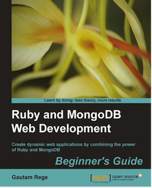

[](https://gitpitch.com/enogrob/ebook-project/master)
```
Roberto Nogueira  
BSd EE, MSd CE
Solution Integrator Experienced - Certified by Ericsson
```
# eBook project



**Book Description**

MongoDB is a high-performance, open source, schema-free document-oriented database. Ruby is an object- oriented scripting language. Ruby and MongoDB are an ideal partnership for building scalable web applications.

Ruby and MongoDB Web Development Beginner's Guide is a fast-paced, hands-on guide to get started with web application development using Ruby and MongoDB. The book follows a practical approach, using clear and step-by-step instructions and examples in Ruby to demonstrate application development using MongoDB.

The book starts by introducing the concepts of MongoDB. The book teaches everything right from the installation to creating objects, MongoDB internals, queries and Ruby Data Mappers.

You will learn how to use various Ruby data mappers like Mongoid and MongoMapper to map Ruby objects to MongoDB documents.

You will learn MongoDB features and deal with geo-spatial indexing with MongoDB and Scaling MongoDB.

With its coverage of concepts and practical examples, Ruby and MongoDB Web Development Beginner's Guide is the right choice for Ruby developers to get started with developing websites with MongoDB as the database.

**What You Will Learn**

* Get MongoDB and Ruby up and running on your machine (Windows/Mac/Linux)
* Leverage MongoDB to build highly scalable data-centric applications
* Leverage MongoDB replication to ensure high availability and reliability
* Create your first object and save it to MongoDB
* Create a Ruby Object and map it to MongoDB document
* Process large datasets with MapReduce
* Create geo-spatial indexes or 2D indexes
* Learn about Mongoid and MongoMapper for mapping Ruby objects to MongoDB documents
* Learn everything you need to about the subject of this `eBook` project.

[Homepage](https://www.packtpub.com/web-development/ruby-and-mongodb-web-development-beginners-guide)

## Topics
```
1: INSTALLING MONGODB AND RUBY
[ ] Installing Ruby
[ ] Installing MongoDB
[ ] Configuring the MongoDB server
[ ] Starting MongoDB
[ ] Stopping MongoDB
[ ] The MongoDB CLI
[ ] Installing Rails/Sinatra
[ ] Summary
2: DIVING DEEP INTO MONGODB
[ ] Creating documents
[ ] Time for action — creating our first document
[ ] Using MongoDB embedded documents
[ ] Time for action — embedding reviews and votes
[ ] Using MongoDB document relationships
[ ] Time for action — creating document relations
[ ] Comparing MongoDB versus SQL syntax
[ ] Using Map/Reduce instead of join
[ ] Time for action — writing the map function for calculating vote statistics
[ ] Time for action — writing the reduce function to process emitted information
[ ] Understanding the Ruby perspective
[ ] Time for action — creating the project
[ ] Time for action — start your engines
[ ] Time for action — configuring Mongoid
[ ] Time for action — planning the object schema
[ ] Time for action — putting it all together
[ ] Time for action — adding reviews to books
[ ] Time for action — embedding Lease and Purchase models
[ ] Time for action — writing the map function to calculate ratings
[ ] Time for action — writing the reduce function to process the emitted results
[ ] Time for action — working with Map/Reduce using Ruby
[ ] Summary
3: MONGODB INTERNALS
[ ] Understanding Binary JSON
[ ] What is ObjectId?
[ ] Documents and collections
[ ] JavaScript and MongoDB
[ ] Time for action — writing our own custom functions in MongoDB
[ ] Ensuring write consistency or "read your writes"
[ ] Global write lock
[ ] Transactional support in MongoDB
[ ] Time for action — implementing optimistic locking
[ ] Why are there no joins in MongoDB?
[ ] Summary
4: WORKING OUT YOUR WAY WITH QUERIES
[ ] Searching by fields in a document
[ ] Time for action — searching by a string value
[ ] Time for action — fetching only for specific fields
[ ] Time for action — skipping documents and limiting our search results
[ ] Time for action — finding books by name or publisher
[ ] Time for action — finding the highly ranked books
[ ] Searching inside arrays
[ ] Time for action — searching inside reviews
[ ] Searching inside hashes
[ ] Searching inside embedded documents
[ ] Searching with regular expressions
[ ] Time for action — using regular expression searches
[ ] Summary
5: RUBY DATAMAPPERS: RUBY AND MONGODB GO HAND IN HAND
[ ] Why do we need Ruby DataMappers
[ ] Time for action — using mongo gem
[ ] The Ruby DataMappers for MongoDB
[ ] Setting up DataMappers
[ ] Time for action — configuring MongoMapper
[ ] Time for action — setting up Mongoid
[ ] Creating, updating, and destroying documents
[ ] Time for action — creating and updating objects
[ ] Using finder methods
[ ] Using MongoDB criteria
[ ] Time for action — fetching using the where criterion
[ ] Understanding model relationships
[ ] Time for action — relating models
[ ] Time for action — categorizing books
[ ] Time for action — adding book details
[ ] Time for action — managing the driver entities
[ ] Time for action — creating vehicles using basic polymorphism
[ ] Using embedded objects
[ ] Time for action — creating embedded objects
[ ] Reverse embedded relations in Mongoid
[ ] Time for action — using embeds_one without specifying embedded_in
[ ] Time for action — using embeds_many without specifying embedded_in
[ ] Understanding embedded polymorphism
[ ] Time for action — adding licenses to drivers
[ ] Time for action — insuring drivers
[ ] Choosing whether to embed or to associate documents
[ ] Mongoid or MongoMapper — the verdict
[ ] Summary
6: MODELING RUBY WITH MONGOID
[ ] Developing a web application with Mongoid
[ ] Time for action — setting up a Rails project
[ ] Time for action — using Sinatra professionally
[ ] Defining attributes in models
[ ] Time for action — adding dynamic fields
[ ] Time for action — localizing fields
[ ] Using arrays and hashes in models
[ ] Defining relations in models
[ ] Time for action — configuring the many-to-many relation
[ ] Time for action — setting up the following and followers relationship
[ ] Time for action — setting up cyclic relations
[ ] Managing changes in models
[ ] Time for action — changing models
[ ] Mixing in Mongoid modules
[ ] Time for action — getting paranoid
[ ] Time for action — including a version
[ ] Summary
7: ACHIEVING HIGH PERFORMANCE ON YOUR RUBY APPLICATION WITH MONGODB
[ ] Profiling MongoDB
[ ] Time for action — enabling profiling for MongoDB
[ ] Using the explain function
[ ] Time for action — explaining a query
[ ] Using covered indexes
[ ] Time for action — using covered indexes
[ ] Other MongoDB performance tuning techniques
[ ] Understanding web application performance
[ ] Optimizing our code for performance
[ ] Optimizing and tuning the web application stack
[ ] Summary
8: RACK, SINATRA, RAILS, AND MONGODB — MAKING USE OF THEM ALL
[ ] Revisiting Sodibee
[ ] The Rails way
[ ] Time for action — modeling the Author class
[ ] Time for action — writing the Book, Category and Address models
[ ] Time for action — modeling the Order class
[ ] Time for action — configuring routes
[ ] Time for action — writing the AuthorsController
[ ] Time for action — designing the layout
[ ] Time for action — listing authors
[ ] Time for action — adding new authors and books
[ ] The Sinatra way
[ ] Time for action — setting up Sinatra and Rack
[ ] Testing and automation using RSpec
[ ] Time for action — installing RSpec
[ ] Time for action — sporking it
[ ] Documenting code using YARD
[ ] Summary
9: GOING EVERYWHERE — GEOSPATIAL INDEXING WITH MONGODB
[ ] What is geolocation
[ ] Identifying the exact geolocation
[ ] Storing coordinates in MongoDB
[ ] Time for action — geocoding the Address model
[ ] Time for action — saving geolocation coordinates
[ ] Time for action — using geocoder for storing coordinates
[ ] Firing geolocation queries
[ ] Time for action — finding nearby addresses
[ ] Time for action — firing near queries in Mongoid
[ ] Summary
10: SCALING MONGODB
[ ] High availability and failover via replication
[ ] Time for action — setting up the master/slave replication
[ ] Time for action — implementing replica sets
[ ] Implementing replica sets for Sodibee
[ ] Time for action — configuring replica sets for Sodibee
[ ] Implementing sharding
[ ] Time for action — setting up the shards
[ ] Time for action — starting the config server
[ ] Time for action — setting up mongos
[ ] Implementing Map/Reduce
[ ] Time for action — planning the Map/Reduce functionality
[ ] Time for action — Map/Reduce via the mongo console
[ ] Time for action — Map/Reduce via Ruby
[ ] Time for action — iterating Ruby objects
[ ] Summary
```
